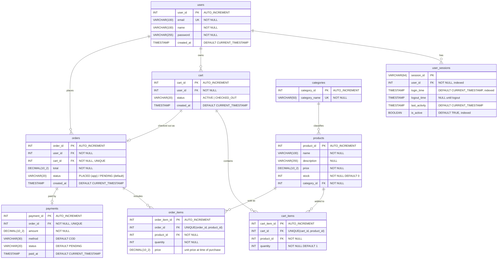

# Entity–Relationship Diagram — `ecommerce_db`

This document describes the database behind the multithreaded web server. It covers the
conceptual model (Chen notation), the relational model (crow's foot), a data dictionary,
the relationships and their constraints, and how the checkout transaction moves data
between tables.

Source of truth: [`../ecommerce_db.sql`](../ecommerce_db.sql) and the queries in
[`../main.cpp`](../main.cpp). The diagrams are generated by
[`gen_er_diagram.py`](gen_er_diagram.py). Re-run it after any schema change:

```bash
python docs/gen_er_diagram.py docs
```

---

## 1. Conceptual ER diagram (Chen notation)


How to read it:

- **Rectangles** are entities, **diamonds** are relationships, **ovals** are attributes.
- **Underlined** attributes are keys. The **dashed** oval (`ORDER.total`) is a *derived*
  attribute. It can be computed as `Σ quantity × unit price` over the order's items but is
  stored so it does not have to be recomputed.
- **1 / N / M** are cardinality ratios. A **double line** means *total participation*:
  every instance of that entity must take part in the relationship. For example, every
  ORDER is placed by a USER.
- Foreign keys are **not** drawn as attributes here. In a conceptual model they are
  represented by the relationships themselves.
- `cart_items` and `order_items` appear as the **M:N relationships `CONTAINS` and
  `INCLUDES`**, with their own attributes (`quantity`, `unit price`). They become separate
  tables only in the relational model (section 2).

## 2. Relational ER diagram (crow's foot)


Each connector runs from the parent's primary key to the child's foreign-key row. The
symbol at each end gives the *minimum* and *maximum* number of rows on that side.

### Mermaid version (renders on GitHub / VS Code)



> Mermaid does not allow commas inside type names, so `DECIMAL(10,2)` is written
> `DECIMAL(10_2)` in this block only.

---

## 3. Entities (data dictionary)

Legend: **PK** primary key · **FK** foreign key · **UQ** unique · **AI** auto-increment ·
**NN** not null.

### 3.1 `users`: registered customers

| Column | Type | Constraints | Notes |
|---|---|---|---|
| `user_id` | INT | PK, AI | Surrogate key |
| `email` | VARCHAR(100) | NN, UQ | Login identifier; checked for duplicates at registration |
| `name` | VARCHAR(100) | NN | Display name |
| `password` | VARCHAR(255) | NN | Currently stored **as plain text** (see §7) |
| `created_at` | TIMESTAMP | DEFAULT CURRENT_TIMESTAMP | |

### 3.2 `user_sessions`: login sessions (one row per login)

| Column | Type | Constraints | Notes |
|---|---|---|---|
| `session_id` | VARCHAR(64) | PK | Random token, sent to the browser as a cookie |
| `user_id` | INT | FK → `users`, NN, indexed | |
| `login_time` | TIMESTAMP | DEFAULT CURRENT_TIMESTAMP, indexed | |
| `logout_time` | TIMESTAMP | NULL | Set on logout |
| `last_activity` | TIMESTAMP | DEFAULT CURRENT_TIMESTAMP | Updated on each authenticated request |
| `is_active` | BOOLEAN | NN, DEFAULT TRUE, indexed | Set to FALSE on logout |

Indexes: `idx_sessions_user (user_id)`, `idx_sessions_active (is_active)`,
`idx_sessions_login (login_time)`.

### 3.3 `categories`: product classification

| Column | Type | Constraints | Notes |
|---|---|---|---|
| `category_id` | INT | PK, AI | |
| `category_name` | VARCHAR(50) | NN, UQ | 15 seeded values (Electronics, Audio, Books, …) |

### 3.4 `products`: catalogue and inventory

| Column | Type | Constraints | Notes |
|---|---|---|---|
| `product_id` | INT | PK, AI | |
| `name` | VARCHAR(100) | NN | |
| `description` | VARCHAR(255) | NULL | |
| `price` | DECIMAL(10,2) | NN | Current selling price |
| `stock` | INT | NN, DEFAULT 0 | Decremented atomically at checkout |
| `category_id` | INT | FK → `categories`, NN | |

### 3.5 `cart`: shopping carts (history kept)

| Column | Type | Constraints | Notes |
|---|---|---|---|
| `cart_id` | INT | PK, AI | |
| `user_id` | INT | FK → `users`, NN | |
| `status` | VARCHAR(20) | NN, DEFAULT 'ACTIVE' | `ACTIVE` → `CHECKED_OUT` |
| `created_at` | TIMESTAMP | DEFAULT CURRENT_TIMESTAMP | |

### 3.6 `cart_items`: products in a cart (resolves CART M:N PRODUCT)

| Column | Type | Constraints | Notes |
|---|---|---|---|
| `cart_item_id` | INT | PK, AI | |
| `cart_id` | INT | FK → `cart`, NN | |
| `product_id` | INT | FK → `products`, NN | |
| `quantity` | INT | NN, DEFAULT 1 | Incremented when the same product is added again |

Composite unique key: `(cart_id, product_id)`. A product appears at most once per cart.

### 3.7 `orders`: placed orders

| Column | Type | Constraints | Notes |
|---|---|---|---|
| `order_id` | INT | PK, AI | |
| `user_id` | INT | FK → `users`, NN | |
| `cart_id` | INT | FK → `cart`, NN, **UQ** | One order per cart |
| `total` | DECIMAL(10,2) | NN | Derived: Σ `order_items.quantity × price` |
| `status` | VARCHAR(20) | DEFAULT 'PENDING' | Application inserts `'PLACED'` |
| `created_at` | TIMESTAMP | DEFAULT CURRENT_TIMESTAMP | |

### 3.8 `order_items`: products in an order (resolves ORDER M:N PRODUCT)

| Column | Type | Constraints | Notes |
|---|---|---|---|
| `order_item_id` | INT | PK, AI | |
| `order_id` | INT | FK → `orders`, NN | |
| `product_id` | INT | FK → `products`, NN | |
| `quantity` | INT | NN | |
| `price` | DECIMAL(10,2) | NN | **Snapshot** of the unit price at purchase time |

Composite unique key: `(order_id, product_id)`.

### 3.9 `payments`: payment record per order

| Column | Type | Constraints | Notes |
|---|---|---|---|
| `payment_id` | INT | PK, AI | |
| `order_id` | INT | FK → `orders`, NN, **UQ** | One payment per order |
| `amount` | DECIMAL(10,2) | NN | Equals `orders.total` at creation |
| `method` | VARCHAR(30) | DEFAULT 'COD' | |
| `status` | VARCHAR(20) | DEFAULT 'PENDING' | |
| `paid_at` | TIMESTAMP | DEFAULT CURRENT_TIMESTAMP | |

---

## 4. Relationships

| # | Parent (1) | Child | Relationship | Cardinality | Implemented by | Participation |
|---|---|---|---|---|---|---|
| R1 | `users` | `user_sessions` | has | 1 : 0..N | `user_sessions.user_id` NN | Session total, user partial |
| R2 | `users` | `cart` | owns | 1 : 0..N | `cart.user_id` NN | Cart total, user partial |
| R3 | `users` | `orders` | places | 1 : 0..N | `orders.user_id` NN | Order total, user partial |
| R4 | `categories` | `products` | classifies | 1 : 0..N | `products.category_id` NN | Product total, category partial |
| R5 | `cart` | `cart_items` | contains | 1 : 0..N | `cart_items.cart_id` NN | |
| R6 | `products` | `cart_items` | added to | 1 : 0..N | `cart_items.product_id` NN | |
| R7 | `cart` | `orders` | checked out as | **1 : 0..1** | `orders.cart_id` NN **UNIQUE** | Order total, cart partial |
| R8 | `orders` | `order_items` | includes | 1 : 0..N (app: 1..N) | `order_items.order_id` NN | |
| R9 | `products` | `order_items` | sold as | 1 : 0..N | `order_items.product_id` NN | |
| R10 | `orders` | `payments` | paid by | **1 : 0..1** | `payments.order_id` NN **UNIQUE** | Payment total, order partial |

R5 + R6 together resolve the **M:N** relationship *CART contains PRODUCT*. R8 + R9 resolve
the **M:N** relationship *ORDER includes PRODUCT*. The constraint is what turns R7 and R10
into one-to-one relationships: the **UNIQUE** on the foreign key. Without it they would be
one-to-many.

None of the foreign keys declare `ON DELETE` / `ON UPDATE` actions, so MySQL uses the
default `RESTRICT`. A parent row (for example a user who has orders) cannot be deleted
while child rows still reference it.

---

## 5. Conceptual → relational mapping

| Conceptual element | Mapping rule | Resulting table / column |
|---|---|---|
| Strong entities USER, SESSION, CATEGORY, PRODUCT, CART, ORDER, PAYMENT | One table each, key → PK | `users`, `user_sessions`, `categories`, `products`, `cart`, `orders`, `payments` |
| 1:N HAS, OWNS, PLACES, BELONGS_TO | FK on the N side | `user_sessions.user_id`, `cart.user_id`, `orders.user_id`, `products.category_id` |
| 1:1 CHECKED_OUT_AS (ORDER total) | FK + UNIQUE on the total-participation side | `orders.cart_id UNIQUE` |
| 1:1 PAID_BY (PAYMENT total) | FK + UNIQUE on the total-participation side | `payments.order_id UNIQUE` |
| M:N CONTAINS {quantity} | New table with both FKs + relationship attributes | `cart_items(cart_id, product_id, quantity)` |
| M:N INCLUDES {quantity, unit price} | New table with both FKs + relationship attributes | `order_items(order_id, product_id, quantity, price)` |

Both junction tables use a surrogate PK (`cart_item_id`, `order_item_id`). The natural key
`(fk1, fk2)` is still enforced by a `UNIQUE` constraint, so the M:N semantics hold.

---

## 6. Data lifecycle: the checkout transaction

`main.cpp` runs checkout as a single transaction under `dbMutex`. The cart rows are read
with `SELECT … FOR UPDATE`. In order:

```
cart (ACTIVE) ──► cart_items ──read FOR UPDATE──┐
                                                ▼
             1. INSERT orders        (user_id, cart_id, total, 'PLACED')
             2. INSERT order_items   (one row per cart item, price snapshot)
             3. UPDATE products      SET stock = stock - qty  WHERE stock >= qty
                                     (affected_rows must be 1, else ROLLBACK)
             4. INSERT payments      (order_id, total, 'COD', 'PENDING')
             5. DELETE cart_items    WHERE cart_id = ?
             6. UPDATE cart          SET status = 'CHECKED_OUT'
             ─────────────────────────────────────────────
             COMMIT  (or ROLLBACK if any step fails)
```

The next time the user adds to the cart, the application creates a new `ACTIVE` cart. This
is why one user can have many carts (R2) but each cart produces at most one order (R7).

---

## 7. Design notes and known limitations

These come from reading the schema and code. They are worth discussing when the design is
reviewed.

1. **"One ACTIVE cart per user" is enforced only by the application.** Today it holds
   because every DB call runs under the single global `dbMutex`, so the
   "find active cart, else insert" step never interleaves. If the server moved to a
   connection pool, two requests could each create an `ACTIVE` cart. The database could
   enforce the rule itself in MySQL 8 with a generated column,
   `active_user_id = IF(status='ACTIVE', user_id, NULL)`, and a `UNIQUE` index on it.
2. **Redundant path `orders.user_id`.** The user can already be reached through
   `orders.cart_id → cart.user_id`. No constraint keeps the two consistent. This is not a
   3NF violation, because `cart_id` is a candidate key of `orders`. It is still an
   inter-table redundancy, kept for simpler and faster "my orders" queries.
3. **Stored derived values.** `orders.total` and `payments.amount` can both be computed
   from `order_items`. Storing them is acceptable because they are written once inside the
   checkout transaction and never changed afterwards.
4. **`order_items.price` is deliberate, not redundant.** It records the price at
   purchase time, so a later change to `products.price` does not rewrite order history.
5. **Status columns are free-text `VARCHAR`.** `cart.status`, `orders.status` and
   `payments.status` accept any string. Adding `ENUM` or `CHECK` constraints would block
   invalid states. The `orders.status` default (`'PENDING'`) also differs from the value the
   application inserts (`'PLACED'`).
6. **No `CHECK` on quantities or money.** `stock >= 0`, `quantity > 0` and `price >= 0` are
   only guarded by application logic.
7. **Passwords are stored in plain text.** They should be stored as a salted hash, for
   example bcrypt or Argon2. The `VARCHAR(255)` column is already wide enough.
8. **Schema / code mismatch.** `buildProductsPage()` in `main.cpp` selects a column named
   `category` from `products`, but the table has `category_id`. A `JOIN categories` is
   needed to show the category name.
