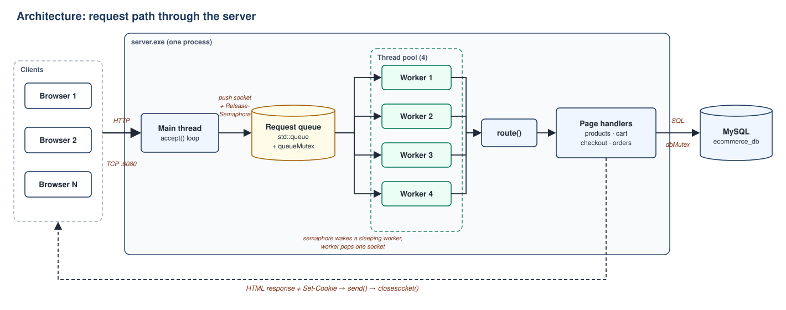
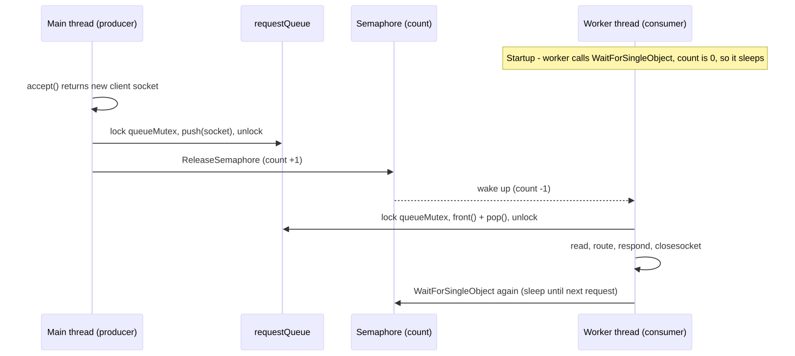
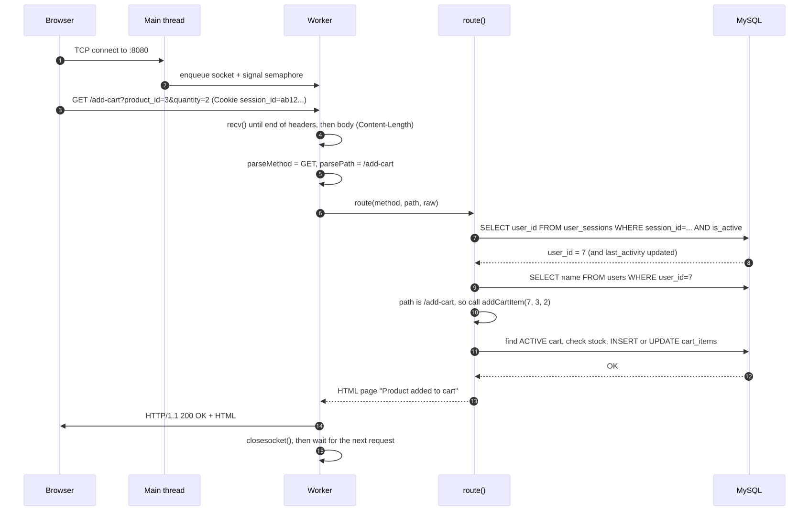
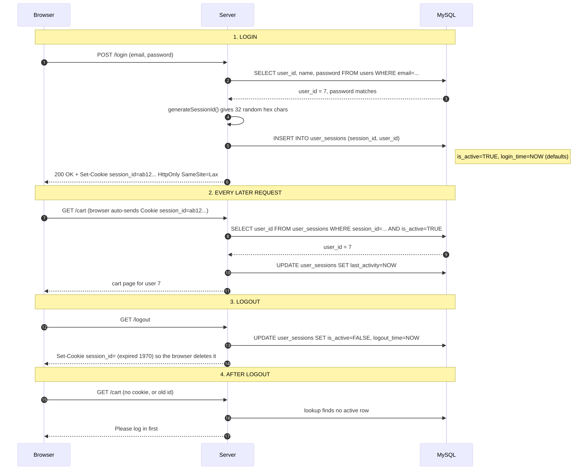
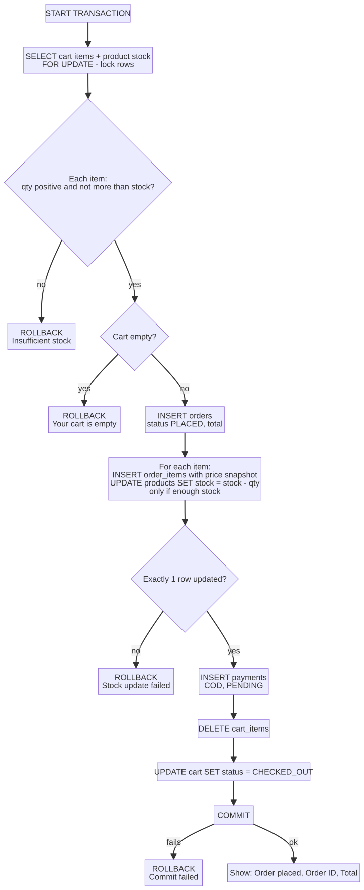
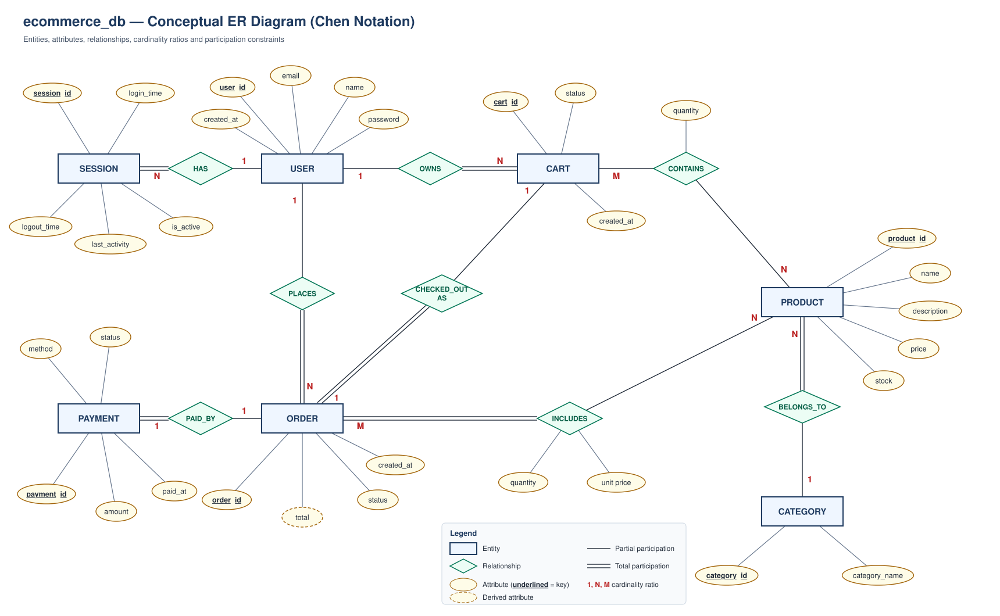
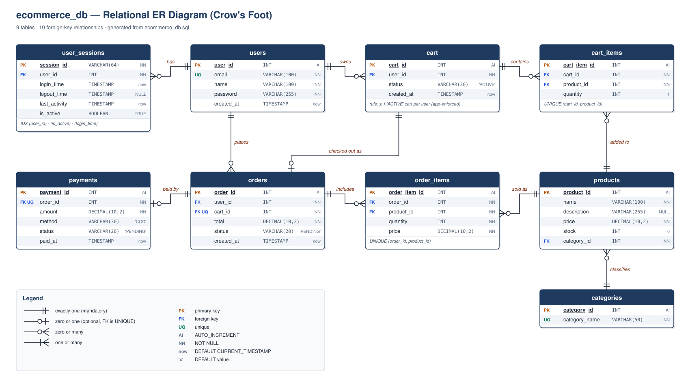

# Multithreaded Web Server with Database Integration

## Complete Project Documentation

This guide explains the **whole project from start to finish**: what each part does,
**why** it is built that way, and what would go wrong without it. It assumes basic C++ and
SQL, and explains everything else along the way.

> Everything in one place: how the server works and why, the database design with ER diagrams, limitations, and viva preparation.
>
> **Team:** Shoyam Bishnoi (Leader) · Sneha Negi · Ashutosh · Aradhana K. Jaiswal

---

## Table of contents

1. [The project in one minute](#1-the-project-in-one-minute)
2. [A real-world analogy](#2-a-real-world-analogy)
3. [Technology choices and why](#3-technology-choices-and-why)
4. [Files in the repository](#4-files-in-the-repository)
5. [How to run it](#5-how-to-run-it)
6. [Big-picture architecture](#6-big-picture-architecture)
7. [Server startup](#7-server-startup-main)
8. [Multithreading: thread pool, queue, semaphore, mutex](#8-multithreading-thread-pool-queue-semaphore-mutex)
9. [Life of one request](#9-life-of-one-request)
10. [Understanding HTTP: what the server actually reads](#10-understanding-http-what-the-server-actually-reads)
11. [The router](#11-the-router)
12. [Building pages (HTML)](#12-building-pages-html)
13. [Users: signup and login](#13-users-signup-and-login)
14. [Sessions: how the server remembers you](#14-sessions-how-the-server-remembers-you)
15. [Products page](#15-products-page)
16. [Cart](#16-cart)
17. [Checkout: the transaction](#17-checkout-the-transaction)
18. [Orders page](#18-orders-page)
19. [Database design and ER diagrams](#19-database-design-and-er-diagrams)
20. [OS and DBMS concepts used (syllabus map)](#20-os-and-dbms-concepts-used-syllabus-map)
21. [Known limitations and how to improve them](#21-known-limitations-and-how-to-improve-them)
22. [Viva / review questions](#22-viva--review-questions)
23. [Glossary](#23-glossary)

---

## 1. The project in one minute

This is a **small online shop** (like a mini Amazon). The interesting part is not the shop
itself, but **how it is built**:

- We wrote our **own web server in C++**, directly on top of network sockets. There is no
  Apache, Nginx, Node.js or framework.
- The server can serve **many users at the same time** using a **thread pool** (4 worker
  threads).
- All data (users, products, carts, orders, payments, login sessions) is stored in
  **MySQL**.
- Placing an order is done as a **database transaction**. Either *everything* happens
  (order created, stock reduced, payment recorded, cart emptied) or *nothing* happens.
  Two people buying the last item at the same time can never both get it.

The goal was to see **Operating Systems** concepts (threads, synchronization,
producer–consumer, critical sections) and **DBMS** concepts (transactions, ACID, locking,
normalization) working together in one real program.

---

## 2. A real-world analogy

Think of the server as a **restaurant**:

| Restaurant | Our server | Code |
|---|---|---|
| Customer walks in | Browser opens a TCP connection | `accept()` |
| Receptionist at the door | **Main thread**: only accepts customers and seats them in the queue | `main()` loop |
| Waiting list / order slips | **Request queue** | `requestQueue` |
| Bell that rings when a slip is added | **Semaphore**: wakes a sleeping waiter | `requestSemaphore` |
| Rule: only one hand on the slip pile at a time | **Mutex** on the queue | `queueMutex` |
| 4 waiters | **4 worker threads** | `worker()` |
| One shared kitchen with one chef | **One MySQL connection**, used by one waiter at a time | `dbConn` + `dbMutex` |
| Loyalty card the customer shows each visit | **Session cookie** | `session_id` |
| Bill must be fully paid or fully cancelled | **Transaction** (COMMIT / ROLLBACK) | `checkoutCart()` |

The receptionist never cooks. That is why the restaurant keeps accepting new customers even
when every waiter is busy.

---

## 3. Technology choices and why

| Technology | Used for | Why we chose it |
|---|---|---|
| **C++** | Entire server | Gives direct control over threads, memory and sockets. Nothing is hidden by a framework, so the OS concepts are visible in the code. |
| **Winsock2** (`winsock2.h`) | Networking (TCP sockets) | The Windows socket API. We read raw bytes and parse HTTP ourselves, which shows how a web server really works underneath. |
| **`std::thread`** | Worker threads | Standard C++ threads, portable and simple. |
| **`std::mutex` + `lock_guard`** | Mutual exclusion | `lock_guard` unlocks automatically when the function returns, even on an early `return`. It is impossible to "forget to unlock". |
| **Windows semaphore** (`CreateSemaphore`) | Counting queued requests | A counting semaphore is the textbook tool for producer–consumer. Idle threads sleep (0% CPU) instead of looping and checking. |
| **`thread_local`** | Per-request data (session, user name) | Each thread gets its own copy, so concurrent requests never mix up users. |
| **MySQL + C API** (`mysql.h`, `libmysql.dll`) | Persistent storage | A relational DB with real transactions (InnoDB), row locks and foreign keys, which is exactly what the DBMS part needs. |
| **Server-generated HTML** | User interface | The server builds each page as a string. There is no separate frontend build step, so the whole system is one program. |
| **Cookies** | Remembering logged-in users | HTTP itself is stateless. Cookies are the standard way to carry a session ID automatically. |
| **g++ (MinGW)** | Compiler | Free, and works with the VS Code task in `.vscode/tasks.json`. |

---

## 4. Files in the repository

```
multithreaded-webserver-db/
├── main.cpp              ← the entire server (~2,500 lines)
├── ecommerce_db.sql      ← creates the database, 9 tables, and sample data
├── server.exe            ← compiled server (Windows)
├── libmysql.dll          ← MySQL client library; must sit next to server.exe
├── .vscode/
│   ├── tasks.json        ← "build" task: g++ command with MySQL include/lib paths
│   └── launch.json       ← debugger configuration
└── docs/
    ├── README.md            ← project overview
    ├── PROJECT_DOCUMENTATION.md ← this file (everything in one)
    ├── PROJECT_DOCUMENTATION.pdf ← same, as a single PDF
    ├── er_diagram_*.svg     ← the diagrams
    ├── gen_er_diagram.py    ← regenerates the ER diagrams
    ├── diagrams/            ← flow diagrams used in this guide (.svg + Mermaid .mmd source)
    └── architecture*.png    ← architecture images
```

`main.cpp` is organised into clearly labelled sections, top to bottom:

| Section | Main functions | Purpose |
|---|---|---|
| CONFIG | `DB_HOST`, `DB_USER`, … | Database connection settings |
| THREAD POOL | `Request`, `requestQueue`, `queueMutex`, `requestSemaphore` | Shared work queue |
| DB | `initDatabase()`, `esc()` | Connect to MySQL; escape user input |
| REQUEST CONTEXT | `tlSessionId`, `tlUserName`, `tlExtraHeaders`, `isLoggedIn()` | Per-thread "who is this request from" |
| HTML HELPERS | `htmlEscape()`, `pageWrapper()` | Safe text output; common page layout |
| SESSION MANAGEMENT | `generateSessionId()`, `createSession()`, `getSessionUserId()`, `logoutSession()`, `getCookie()`, `getUserName()` | Login sessions |
| SESSION PAGE | `buildSessionPage()` | "My Session" page |
| PRODUCTS / SIGNUP / LOGIN | `buildProductsPage()`, `handleSignup()`, `handleLogin()` | Catalogue and accounts |
| CART | `getActiveCartIdLocked()`, `buildCartPage()`, `addCartItem()`, `removeCartItem()` | Shopping cart |
| ORDERS AND PAYMENTS | `checkoutCart()`, `buildOrdersPage()` | Checkout transaction and history |
| HTTP PARSING | `parseMethod()`, `parsePath()`, `parseQuery()`, `parseFormBody()`, `urlDecode()`, `contentLength()` | Understanding the raw request |
| HTTP RESPONSE | `makeHttpResponse()` | Building the reply |
| ROUTER | `route()` | Deciding which function handles a URL |
| WORKER | `worker()` | What each thread does forever |
| MAIN | `main()` | Startup and the accept loop |

---

## 5. How to run it

1. **Install MySQL Server 8.0** (the build task expects
   `C:/Program Files/MySQL/MySQL Server 8.0/`).
2. **Create the database:**
   ```powershell
   mysql -u root -p < ecommerce_db.sql
   ```
3. **Set your DB password** in `main.cpp` (`DB_PASS`, near the top).
4. **Build** in VS Code with `Ctrl+Shift+B`, or run:
   ```powershell
   g++ -g main.cpp -o server.exe -I "C:/Program Files/MySQL/MySQL Server 8.0/include" -L "C:/Program Files/MySQL/MySQL Server 8.0/lib" -lmysql -lws2_32 -static-libgcc -static-libstdc++
   ```
5. **Run** `server.exe`. `libmysql.dll` must be in the same folder. You should see:
   ```
   [DB] Connected to MySQL successfully.
   Server on http://localhost:8080
   ```
6. Open **http://localhost:8080** in a browser. Each request is logged as
   `[W2] GET /products`, where `W2` is the worker thread that handled it.

**Why `-lws2_32`?** It links the Windows socket library.
**Why `-lmysql`?** It links the MySQL client library.
**Why `-static-libgcc -static-libstdc++`?** So `server.exe` runs on PCs without MinGW installed.

---

## 6. Big-picture architecture



The flow in words:
**Browser → main thread accepts → queue → free worker picks it up → reads and parses HTTP →
router → handler → MySQL → HTML response → browser.**

---

## 7. Server startup (`main()`)

When you run `server.exe`, `main()` does this **once**:

| Step | Code | What it does | Why |
|---|---|---|---|
| 1 | `WSAStartup(MAKEWORD(2,2), …)` | Initialises Windows networking | On Windows, you must do this before using any socket function. |
| 2 | `initDatabase()` | `mysql_init` + `mysql_real_connect` + `utf8mb4` | Connect **once** at startup. Connecting per request would be slow. `utf8mb4` supports all characters, including ₹ and emoji. |
| 3 | `CreateSemaphore(NULL, 0, 1000, NULL)` | Counting semaphore, starting at **0** | 0 means "no requests waiting yet". Workers that wait on it go to sleep. |
| 4 | `socket(AF_INET, SOCK_STREAM, IPPROTO_TCP)` | Creates a TCP socket | HTTP runs over TCP, which is reliable and keeps bytes in order. |
| 5 | `bind(… port 8080, INADDR_ANY)` | Attaches the socket to port 8080 on all network interfaces | So browsers can reach `localhost:8080`. |
| 6 | `listen(serverSocket, SOMAXCONN)` | Starts accepting connections | `SOMAXCONN` lets the OS queue as many pending connections as it allows. |
| 7 | Start 4 `worker` threads | The thread pool | Threads are created **once** and reused (see §8). |
| 8 | `while(true) { accept → push → ReleaseSemaphore }` | Main loop, runs forever | The main thread only *accepts* connections, so it is always ready for the next customer. |

If any step fails, the program cleans up what it already created (closes the socket,
semaphore and DB connection, then calls `WSACleanup`) and exits. This avoids leaking
resources.

---

## 8. Multithreading: thread pool, queue, semaphore, mutex

This is the **Operating Systems heart** of the project.

### 8.1 Why multithreading at all?

If the server handled one request at a time, a slow client (for example on a weak mobile
connection) would block **everyone else**. With multiple threads, other users are served
while one waits.

### 8.2 Why a *thread pool* and not "one new thread per request"?

| One thread per request | Thread pool (what we use) |
|---|---|
| Creating and destroying a thread costs time and memory on **every** request | 4 threads are created **once** at startup and reused forever |
| 10,000 visitors could create 10,000 threads and crash the machine | At most 4 threads; extra requests wait safely in the queue |
| Hard to control | Predictable, bounded resource use |

### 8.3 The producer–consumer pattern



<sub>Diagram source: [diagrams/producer_consumer.mmd](diagrams/producer_consumer.mmd)</sub>

### 8.4 Why BOTH a semaphore and a mutex?

They solve **two different problems**:

| Tool | Problem it solves | What goes wrong without it |
|---|---|---|
| **Semaphore** (`requestSemaphore`) | **"Is there work?"** It counts queued requests and puts idle workers to sleep. | Workers would have to spin in a loop (`while(queue.empty()){}`), burning 100% CPU doing nothing (busy waiting). |
| **Mutex** (`queueMutex`) | **"Only one thread touches the queue at a time."** `std::queue` is not thread-safe. | Two threads pushing or popping at the same moment can corrupt the queue's memory (a **race condition**), causing crashes or the same request being handled twice. |

The semaphore guarantees that when a worker wakes up, **there is an item for it**, so the
`front()` + `pop()` is safe.

### 8.5 `thread_local`: keeping users separate

```cpp
thread_local string tlSessionId;    // whose session is this request?
thread_local string tlUserName;     // display name for the nav bar
thread_local string tlExtraHeaders; // e.g. Set-Cookie to send back
```

`thread_local` means **each thread has its own private copy** of these variables. Worker 1
may be serving Radhika while Worker 2 serves Shreya at the same moment, and each sees only
its own user.

**Why not just pass them as function parameters?** About 40 page-building functions would
all need extra parameters. `thread_local` keeps their signatures simple. Because a worker
handles **one request at a time**, the values are always for the current request. The
worker clears them at the start of every request (`tlSessionId.clear()` …), so nothing
leaks from the previous user.

### 8.6 `dbMutex`: protecting the database connection

There is **one** MySQL connection (`dbConn`) shared by all 4 workers. A MySQL connection
**cannot be used by two threads at once**. If it were, their queries and results would get
mixed up. So every function that talks to MySQL starts with:

```cpp
lock_guard<mutex> lock(dbMutex);   // wait for our turn; auto-unlock on return
```

This makes every database operation a **critical section**.

> **Important to understand:** because of `dbMutex`, **database work happens one request at
> a time**. The 4 threads still help, because receiving data, parsing, building HTML and
> sending responses all happen in parallel. Database access is the one shared step that is
> serialized. For higher throughput, the next step would be a **connection pool** (one
> connection per worker), letting MySQL's own row locks handle concurrency.

### 8.7 Deadlock safety

A deadlock needs two threads each holding a lock the other wants. Here:
- `queueMutex` is held only for a push or a pop, never while doing anything else.
- `dbMutex` is held only inside DB functions, and the code never takes `queueMutex` while
  holding `dbMutex`.
- `lock_guard` always releases the lock, even on early `return`.

So there is **no circular wait**, and deadlock cannot occur between these two locks.

---

## 9. Life of one request

Example: a logged-in user clicks **"Add to Cart"** for product 3, quantity 2.



<sub>Diagram source: [diagrams/request_lifecycle.mmd](diagrams/request_lifecycle.mmd)</sub>

---

## 10. Understanding HTTP: what the server actually reads

A browser sends **plain text** over TCP. For example, a login form submission looks like
this:

```
POST /login HTTP/1.1\r\n
Host: localhost:8080\r\n
Cookie: session_id=ab12cd34...\r\n
Content-Type: application/x-www-form-urlencoded\r\n
Content-Length: 41\r\n
\r\n
email=radhika%40mail.com&password=secret1
```

| Part | Parsed by | How |
|---|---|---|
| Method (`POST`) | `parseMethod()` | First word of the request |
| Path (`/login`) | `parsePath()` | Second word, with anything after `?` removed |
| Query string (`?product_id=3&quantity=2`) | `parseQuery()` | Text after `?`, split on `&` and `=` |
| Headers end | `worker()` | Looks for the blank line `\r\n\r\n` |
| Body length | `contentLength()` | Reads the `Content-Length:` header (case-insensitive) |
| Form body | `parseFormBody()` | Text after `\r\n\r\n`, split on `&` and `=` |
| Special characters | `urlDecode()` | `%40` → `@`, `+` → space |
| Cookie | `getCookie()` | Finds the `Cookie:` header and the `session_id=` pair |

**Why read in a loop?** TCP is a **stream**: one `recv()` may return only part of the
request. The worker keeps calling `recv()` until it has the full headers (`\r\n\r\n`), then
keeps reading until it has `Content-Length` bytes of body. Requests with headers over 64 KB
are dropped, which protects memory.

**The response** is also plain text, built by `makeHttpResponse()`:

```
HTTP/1.1 200 OK
Content-Type: text/html; charset=utf-8
Content-Length: 1834
Set-Cookie: session_id=ab12...; Path=/; HttpOnly; SameSite=Lax     ← only when logging in or out
Connection: close

<html>...</html>
```

`Connection: close` means one request per connection. This is simpler, because the worker
closes the socket and is free for the next one.

---

## 11. The router

`route()` is the **traffic controller**. It runs two steps for every request.

**Step 1: identify the user (every request).** It reads the `session_id` cookie and looks
it up in `user_sessions`. If found, it fills `tlSessionId` and `tlUserName`, so the page
shows "Hi, Radhika" and the logged-in menu.

**Step 2: match the path:**

| URL | Method | Login? | Handler | Does |
|---|---|---|---|---|
| `/` | GET | no | inline | Home page; different buttons for guests and users |
| `/products` | GET | no | `buildProductsPage()` | List all products |
| `/signup` | GET / POST | no | `signupForm()` / `handleSignup()` | Show form / create account |
| `/login` | GET / POST | no | `loginForm()` / `handleLogin()` | Show form / log in, create session |
| `/logout` | GET | — | `logoutSession()` | End session, delete cookie |
| `/session` | GET | yes | `buildSessionPage()` | Show your login sessions |
| `/cart` | GET | yes | `buildCartPage()` | Show cart and total |
| `/add-cart` | GET | yes | `addCartItem()` | Add or increase an item |
| `/remove-cart` | GET | yes | `removeCartItem()` | Remove an item |
| `/checkout` | GET | yes | `checkoutCart()` | Place order (transaction) |
| `/orders` | GET | yes | `buildOrdersPage()` | Order and payment history |
| anything else | — | — | `pageWrapper("404")` | Page not found (HTTP 404) |

For "login required" pages, if the session is not valid the router returns a
**"Please log in first"** page instead of running the handler. This is the access-control
check.

---

## 12. Building pages (HTML)

Every page goes through **`pageWrapper(title, body)`**, which adds:
- the shared **CSS** (styles),
- the **navigation bar**: Cart, Orders, Session and Logout when logged in; Login and Sign Up
  buttons when not,
- the **login and sign-up popups** (modals) plus a small JavaScript to open and close them.

**Why one wrapper?** Every page looks consistent, and the layout is defined in one place
(the DRY principle: Don't Repeat Yourself).

**Why `htmlEscape()`?** Any text that came from users or the DB (names, product
descriptions) is escaped: `<` becomes `&lt;`, `>` becomes `&gt;`, and so on. Without this,
a user could register with the name `<script>…</script>` and that script would run in other
people's browsers. That attack is **Cross-Site Scripting (XSS)**.

---

## 13. Users: signup and login

### Signup (`POST /signup` → `handleSignup()`)

1. Check that name, email and password are not empty.
2. Lock `dbMutex`.
3. `SELECT user_id FROM users WHERE email = '…'`. If a row exists, show "Email already
   registered".
4. `INSERT INTO users (name, email, password)`.
5. Show the login form with "Signup successful".

**Why check the email first when the column is already `UNIQUE`?** For a friendly error
message. The `UNIQUE` constraint is still the real guarantee.

**Why `esc()` around every string?** `esc()` calls `mysql_real_escape_string`, which
neutralises quotes. Without it, an email like `' OR '1'='1` could change the meaning of the
SQL query. That attack is **SQL injection**.

### Login (`POST /login` → `handleLogin()`)

1. Look up the user by email (`SELECT user_id, name, password`).
2. Compare passwords. Wrong → "Incorrect password".
3. Create a session (next section) and send the cookie.

---

## 14. Sessions: how the server remembers you

### 14.1 The problem

**HTTP is stateless.** Every request is independent. The server has no built-in way to
know that the request for `/cart` comes from the same person who logged in a minute ago.
So we need a **session**: a random ticket the browser shows on every request.

### 14.2 Where sessions live: the `user_sessions` table

| Column | Meaning |
|---|---|
| `session_id` | The random ticket (32 hex characters) |
| `user_id` | Which user it belongs to |
| `login_time` | When they logged in |
| `last_activity` | When they last made a request (updated every request) |
| `logout_time` | When they logged out (`NULL` while active) |
| `is_active` | `TRUE` = valid, `FALSE` = logged out |

**Why store sessions in the database instead of in server memory?**
- They **survive a server restart**. Users stay logged in.
- They give a **login history** (the "My Session" page) for auditing.
- **Multiple devices** are supported naturally: each login is its own row.
- Logout just flips `is_active`, so old sessions remain as a record.

### 14.3 The full session lifecycle



<sub>Diagram source: [diagrams/session_lifecycle.mmd](diagrams/session_lifecycle.mmd)</sub>

### 14.4 Each step explained

**a) Creating the ID: `generateSessionId()`**
- Builds 32 characters from `0-9a-f` using a random generator (`mt19937_64`) seeded by
  `random_device`.
- 32 hex characters = **128 bits**, about 3.4 × 10³⁸ possibilities. Guessing a valid one is
  practically impossible.
- **Why random and not just 1, 2, 3…?** With sequential IDs, anyone could change their
  cookie to `2` and become another user.

**b) Saving it: `createSession()`**
- `INSERT INTO user_sessions (session_id, user_id)`. The database fills in `login_time`,
  `last_activity` and `is_active` from column defaults.
- If the ID ever collides with an existing one (primary key violation), it retries, up to
  5 times.

**c) Giving it to the browser: the cookie**
```
Set-Cookie: session_id=ab12...; Path=/; HttpOnly; SameSite=Lax
```
| Attribute | Meaning | Why |
|---|---|---|
| `Path=/` | Send the cookie for every URL on the site | All pages need to know the user |
| `HttpOnly` | JavaScript cannot read it | Even if an XSS bug existed, a script could not steal the session |
| `SameSite=Lax` | Not sent with cross-site POSTs or background requests | Reduces Cross-Site Request Forgery (CSRF) |

**Why a cookie instead of putting the ID in every link?** The browser attaches cookies
**automatically**, so no page has to remember to add `?session_id=…`. IDs in URLs also leak
into browser history and server logs. (The code still *accepts* `?session_id=` as a
fallback for old links.)

**d) Checking it on every request: `getSessionUserId()`**
- Looks for the ID **and** `is_active = TRUE`. A logged-out session is useless even if
  someone still has the cookie.
- Updates `last_activity`, which shows when the session was last used.

**e) Ending it: `logoutSession()`**
- Sets `is_active = FALSE` and records `logout_time`. The row is **kept**, not deleted, for
  history.
- Sends an expired cookie so the browser forgets it.

**f) Multiple sessions**
```
Radhika → Chrome → session A123  (active)
Radhika → Edge   → session B456  (active)
Shreya  → Chrome → session C789  (active)
```
Logging out in Chrome only ends A123. Edge stays logged in. The **My Session** page
(`/session`) lists your last 20 sessions and highlights the one this browser is using.

---

## 15. Products page

`/products` → `buildProductsPage()`:
1. `SELECT product_id, name, description, price, stock, … FROM products`.
2. Builds an HTML table. For each product:
   - stock = 0 → "Out of stock"
   - not logged in → a "Login to buy" button that opens the login popup
   - logged in → a quantity box (max = stock) and an **Add to Cart** button

**Why show different buttons?** It guides the user and avoids errors before they happen.
The server still re-checks everything, because the browser cannot be trusted.

> ⚠️ Known bug: the query selects a column named `category`, but the table has
> `category_id`, so MySQL returns *Unknown column*. Fix: join the `categories` table (see §21).

---

## 16. Cart

### Data model
- `cart`: one row per cart, with `status` = `ACTIVE` or `CHECKED_OUT`.
- `cart_items`: one row per product in the cart, with its `quantity`.
- A user has **at most one ACTIVE cart**. Old carts stay as `CHECKED_OUT` history.

### `getActiveCartIdLocked(userId, createIfMissing)`
Finds the user's `ACTIVE` cart. If there is none and `createIfMissing` is true, it inserts a
new one. The name ends in **"Locked"** to warn programmers that **the caller must already
hold `dbMutex`**. This makes "find, else create" one atomic step, so two requests can't
create two active carts.

### Add to cart (`/add-cart` → `addCartItem()`)
1. Reject quantity ≤ 0.
2. Get or create the active cart.
3. Read the product's `stock`.
4. Read how many are **already** in the cart.
5. If `already + new > stock` → "Requested quantity exceeds available stock".
6. Already in the cart → `UPDATE quantity = quantity + n`. Otherwise → `INSERT` a new row.

**Why update instead of inserting twice?** The table has `UNIQUE(cart_id, product_id)`, so
one product appears once per cart with a total quantity. This is cleaner and makes totals
easy.

**Why check stock here *and* again at checkout?** Here it gives early, friendly feedback.
At checkout it is the **real** guarantee, because stock may have changed in between.

### View cart (`/cart`) and remove (`/remove-cart`)
- The view joins `cart_items` with `products` to show name, price and
  `subtotal = quantity × price`, plus a grand total.
- Remove runs `DELETE FROM cart_items WHERE cart_id=… AND product_id=…`.

---

## 17. Checkout: the transaction

This is the **DBMS heart** of the project: `/checkout` → `checkoutCart()`.

### 17.1 What has to happen

Placing an order touches **five tables**:



<sub>Diagram source: [diagrams/checkout_flow.mmd](diagrams/checkout_flow.mmd)</sub>

### 17.2 Why a transaction? (ACID explained with this example)

Suppose the server crashes right after creating the order but **before** reducing stock.
Without a transaction, there is an order for items that were never deducted, and the shop
could sell them twice. A transaction prevents that:

| ACID property | Meaning | In our checkout |
|---|---|---|
| **A**tomicity | All or nothing | Order, items, stock change, payment, and cart clear all succeed, or **ROLLBACK** undoes every one |
| **C**onsistency | Rules are never broken | Stock never goes negative (`WHERE stock >= qty`); foreign keys and `UNIQUE(cart_id)` hold |
| **I**solation | Concurrent transactions don't interfere | `FOR UPDATE` locks the rows; `dbMutex` serializes access |
| **D**urability | Once committed, it stays | After `COMMIT`, InnoDB writes to its log, so the order survives a crash |

### 17.3 Preventing overselling: three layers of protection

Imagine **2 users buy the last 1 unit** at the same moment:

1. **`dbMutex`**: only one checkout runs on the connection at a time, so they are
   processed one after the other.
2. **`SELECT … FOR UPDATE`**: locks the product rows until COMMIT or ROLLBACK. Any other
   transaction (even from another program) must wait.
3. **`UPDATE … SET stock = stock - qty WHERE stock >= qty`**, followed by checking
   `mysql_affected_rows == 1`: the update only succeeds if enough stock exists **at that
   instant**. Otherwise the whole order is rolled back.

Result: the first user gets the item. The second sees *"Insufficient stock"* and nothing
is half-saved.

**Why three layers if one would do?** Defence in depth. Layer 1 works today because there
is one connection. Layers 2 and 3 keep the code correct if we later add a connection pool,
or if another program (an admin panel, for example) changes stock directly.

### 17.4 Other design decisions

| Decision | Why |
|---|---|
| `order_items.price` stores the price **at purchase time** | If the product price changes tomorrow, old orders still show what the customer actually paid. |
| `orders.cart_id` is `UNIQUE` | One cart can become **at most one** order. This blocks accidental double-orders from the same cart. |
| `payments.order_id` is `UNIQUE` | One payment record per order. |
| Cart becomes `CHECKED_OUT` instead of being deleted | Keeps history. The next "Add to cart" automatically creates a fresh `ACTIVE` cart. |
| Payment is `COD` / `PENDING` | No real payment gateway; cash on delivery is recorded as pending. |

---

## 18. Orders page

`/orders` → `buildOrdersPage()`:

```sql
SELECT o.order_id, o.total, o.status, o.created_at, p.method, p.status
FROM orders o
LEFT JOIN payments p ON o.order_id = p.order_id
WHERE o.user_id = ?
ORDER BY o.created_at DESC;
```

**Why `LEFT JOIN`?** An order should still appear even if, for some reason, it has no
payment row. An `INNER JOIN` would silently hide it.

---

## 19. Database design and ER diagrams

Nine tables. This section has the full ER diagrams, data dictionary and design notes.

```
users ─┬─< user_sessions          (1 user : many sessions)
       ├─< cart ─┬─< cart_items >─┐
       │         └─ 0..1 ─ orders │   (1 cart : at most 1 order)
       └─< orders ─┬─< order_items >─ products >─ categories
                   └─ 0..1 ─ payments
```

| Concept | Where you see it | Why |
|---|---|---|
| **Primary keys** (`AUTO_INCREMENT`) | Every table | Unique, stable identity for each row |
| **Foreign keys** | e.g. `cart_items.product_id → products` | The DB refuses rows that point to non-existent data (referential integrity) |
| **UNIQUE constraints** | `users.email`, `(cart_id, product_id)`, `orders.cart_id`, `payments.order_id` | Business rules enforced by the database itself |
| **Indexes** | `user_sessions(user_id)`, `(is_active)`, `(login_time)` | The session lookup runs on **every** request, so it must be fast |
| **Defaults** | `created_at`, `status`, `is_active` | Less code; the DB fills in sensible values |
| **Normalization (3NF)** | Categories in their own table; junction tables for M:N | No duplicated data, so no update anomalies |
| **Transactions** | Checkout | ACID (see §17) |

### 19.1 Conceptual ER diagram (Chen notation)



How to read it:

- **Rectangles** are entities, **diamonds** are relationships, **ovals** are attributes.
- **Underlined** attributes are keys. The **dashed** oval (`ORDER.total`) is a *derived*
  attribute. It can be computed as `Σ quantity × unit price` over the order's items but is
  stored so it does not have to be recomputed.
- **1 / N / M** are cardinality ratios. A **double line** means *total participation*:
  every instance of that entity must take part in the relationship. For example, every
  ORDER is placed by a USER.
- Foreign keys are **not** drawn as attributes here. In a conceptual model they are
  represented by the relationships themselves.
- `cart_items` and `order_items` appear as the **M:N relationships `CONTAINS` and
  `INCLUDES`**, with their own attributes (`quantity`, `unit price`). They become separate
  tables only in the relational model (§19.2).

### 19.2 Relational ER diagram (crow's foot)



Each connector runs from the parent's primary key to the child's foreign-key row. The
symbol at each end gives the *minimum* and *maximum* number of rows on that side.


### 19.3 Entities (data dictionary)

Legend: **PK** primary key · **FK** foreign key · **UQ** unique · **AI** auto-increment ·
**NN** not null.

#### 19.3.1 `users`: registered customers

| Column | Type | Constraints | Notes |
|---|---|---|---|
| `user_id` | INT | PK, AI | Surrogate key |
| `email` | VARCHAR(100) | NN, UQ | Login identifier; checked for duplicates at registration |
| `name` | VARCHAR(100) | NN | Display name |
| `password` | VARCHAR(255) | NN | Currently stored **as plain text** (see §19.7) |
| `created_at` | TIMESTAMP | DEFAULT CURRENT_TIMESTAMP | |

#### 19.3.2 `user_sessions`: login sessions (one row per login)

| Column | Type | Constraints | Notes |
|---|---|---|---|
| `session_id` | VARCHAR(64) | PK | Random token, sent to the browser as a cookie |
| `user_id` | INT | FK → `users`, NN, indexed | |
| `login_time` | TIMESTAMP | DEFAULT CURRENT_TIMESTAMP, indexed | |
| `logout_time` | TIMESTAMP | NULL | Set on logout |
| `last_activity` | TIMESTAMP | DEFAULT CURRENT_TIMESTAMP | Updated on each authenticated request |
| `is_active` | BOOLEAN | NN, DEFAULT TRUE, indexed | Set to FALSE on logout |

Indexes: `idx_sessions_user (user_id)`, `idx_sessions_active (is_active)`,
`idx_sessions_login (login_time)`.

#### 19.3.3 `categories`: product classification

| Column | Type | Constraints | Notes |
|---|---|---|---|
| `category_id` | INT | PK, AI | |
| `category_name` | VARCHAR(50) | NN, UQ | 15 seeded values (Electronics, Audio, Books, …) |

#### 19.3.4 `products`: catalogue and inventory

| Column | Type | Constraints | Notes |
|---|---|---|---|
| `product_id` | INT | PK, AI | |
| `name` | VARCHAR(100) | NN | |
| `description` | VARCHAR(255) | NULL | |
| `price` | DECIMAL(10,2) | NN | Current selling price |
| `stock` | INT | NN, DEFAULT 0 | Decremented atomically at checkout |
| `category_id` | INT | FK → `categories`, NN | |

#### 19.3.5 `cart`: shopping carts (history kept)

| Column | Type | Constraints | Notes |
|---|---|---|---|
| `cart_id` | INT | PK, AI | |
| `user_id` | INT | FK → `users`, NN | |
| `status` | VARCHAR(20) | NN, DEFAULT 'ACTIVE' | `ACTIVE` → `CHECKED_OUT` |
| `created_at` | TIMESTAMP | DEFAULT CURRENT_TIMESTAMP | |

#### 19.3.6 `cart_items`: products in a cart (resolves CART M:N PRODUCT)

| Column | Type | Constraints | Notes |
|---|---|---|---|
| `cart_item_id` | INT | PK, AI | |
| `cart_id` | INT | FK → `cart`, NN | |
| `product_id` | INT | FK → `products`, NN | |
| `quantity` | INT | NN, DEFAULT 1 | Incremented when the same product is added again |

Composite unique key: `(cart_id, product_id)`. A product appears at most once per cart.

#### 19.3.7 `orders`: placed orders

| Column | Type | Constraints | Notes |
|---|---|---|---|
| `order_id` | INT | PK, AI | |
| `user_id` | INT | FK → `users`, NN | |
| `cart_id` | INT | FK → `cart`, NN, **UQ** | One order per cart |
| `total` | DECIMAL(10,2) | NN | Derived: Σ `order_items.quantity × price` |
| `status` | VARCHAR(20) | DEFAULT 'PENDING' | Application inserts `'PLACED'` |
| `created_at` | TIMESTAMP | DEFAULT CURRENT_TIMESTAMP | |

#### 19.3.8 `order_items`: products in an order (resolves ORDER M:N PRODUCT)

| Column | Type | Constraints | Notes |
|---|---|---|---|
| `order_item_id` | INT | PK, AI | |
| `order_id` | INT | FK → `orders`, NN | |
| `product_id` | INT | FK → `products`, NN | |
| `quantity` | INT | NN | |
| `price` | DECIMAL(10,2) | NN | **Snapshot** of the unit price at purchase time |

Composite unique key: `(order_id, product_id)`.

#### 19.3.9 `payments`: payment record per order

| Column | Type | Constraints | Notes |
|---|---|---|---|
| `payment_id` | INT | PK, AI | |
| `order_id` | INT | FK → `orders`, NN, **UQ** | One payment per order |
| `amount` | DECIMAL(10,2) | NN | Equals `orders.total` at creation |
| `method` | VARCHAR(30) | DEFAULT 'COD' | |
| `status` | VARCHAR(20) | DEFAULT 'PENDING' | |
| `paid_at` | TIMESTAMP | DEFAULT CURRENT_TIMESTAMP | |


### 19.4 Relationships

| # | Parent (1) | Child | Relationship | Cardinality | Implemented by | Participation |
|---|---|---|---|---|---|---|
| R1 | `users` | `user_sessions` | has | 1 : 0..N | `user_sessions.user_id` NN | Session total, user partial |
| R2 | `users` | `cart` | owns | 1 : 0..N | `cart.user_id` NN | Cart total, user partial |
| R3 | `users` | `orders` | places | 1 : 0..N | `orders.user_id` NN | Order total, user partial |
| R4 | `categories` | `products` | classifies | 1 : 0..N | `products.category_id` NN | Product total, category partial |
| R5 | `cart` | `cart_items` | contains | 1 : 0..N | `cart_items.cart_id` NN | |
| R6 | `products` | `cart_items` | added to | 1 : 0..N | `cart_items.product_id` NN | |
| R7 | `cart` | `orders` | checked out as | **1 : 0..1** | `orders.cart_id` NN **UNIQUE** | Order total, cart partial |
| R8 | `orders` | `order_items` | includes | 1 : 0..N (app: 1..N) | `order_items.order_id` NN | |
| R9 | `products` | `order_items` | sold as | 1 : 0..N | `order_items.product_id` NN | |
| R10 | `orders` | `payments` | paid by | **1 : 0..1** | `payments.order_id` NN **UNIQUE** | Payment total, order partial |

R5 + R6 together resolve the **M:N** relationship *CART contains PRODUCT*. R8 + R9 resolve
the **M:N** relationship *ORDER includes PRODUCT*. The constraint is what turns R7 and R10
into one-to-one relationships: the **UNIQUE** on the foreign key. Without it they would be
one-to-many.

None of the foreign keys declare `ON DELETE` / `ON UPDATE` actions, so MySQL uses the
default `RESTRICT`. A parent row (for example a user who has orders) cannot be deleted
while child rows still reference it.


### 19.5 Conceptual → relational mapping

| Conceptual element | Mapping rule | Resulting table / column |
|---|---|---|
| Strong entities USER, SESSION, CATEGORY, PRODUCT, CART, ORDER, PAYMENT | One table each, key → PK | `users`, `user_sessions`, `categories`, `products`, `cart`, `orders`, `payments` |
| 1:N HAS, OWNS, PLACES, BELONGS_TO | FK on the N side | `user_sessions.user_id`, `cart.user_id`, `orders.user_id`, `products.category_id` |
| 1:1 CHECKED_OUT_AS (ORDER total) | FK + UNIQUE on the total-participation side | `orders.cart_id UNIQUE` |
| 1:1 PAID_BY (PAYMENT total) | FK + UNIQUE on the total-participation side | `payments.order_id UNIQUE` |
| M:N CONTAINS {quantity} | New table with both FKs + relationship attributes | `cart_items(cart_id, product_id, quantity)` |
| M:N INCLUDES {quantity, unit price} | New table with both FKs + relationship attributes | `order_items(order_id, product_id, quantity, price)` |

Both junction tables use a surrogate PK (`cart_item_id`, `order_item_id`). The natural key
`(fk1, fk2)` is still enforced by a `UNIQUE` constraint, so the M:N semantics hold.


### 19.6 Data lifecycle: the checkout transaction

Covered in full in [§17 Checkout: the transaction](#17-checkout-the-transaction).


### 19.7 Design notes and known limitations

These come from reading the schema and code. They are worth discussing when the design is
reviewed.

1. **"One ACTIVE cart per user" is enforced only by the application.** Today it holds
   because every DB call runs under the single global `dbMutex`, so the
   "find active cart, else insert" step never interleaves. If the server moved to a
   connection pool, two requests could each create an `ACTIVE` cart. The database could
   enforce the rule itself in MySQL 8 with a generated column,
   `active_user_id = IF(status='ACTIVE', user_id, NULL)`, and a `UNIQUE` index on it.
2. **Redundant path `orders.user_id`.** The user can already be reached through
   `orders.cart_id → cart.user_id`. No constraint keeps the two consistent. This is not a
   3NF violation, because `cart_id` is a candidate key of `orders`. It is still an
   inter-table redundancy, kept for simpler and faster "my orders" queries.
3. **Stored derived values.** `orders.total` and `payments.amount` can both be computed
   from `order_items`. Storing them is acceptable because they are written once inside the
   checkout transaction and never changed afterwards.
4. **`order_items.price` is deliberate, not redundant.** It records the price at
   purchase time, so a later change to `products.price` does not rewrite order history.
5. **Status columns are free-text `VARCHAR`.** `cart.status`, `orders.status` and
   `payments.status` accept any string. Adding `ENUM` or `CHECK` constraints would block
   invalid states. The `orders.status` default (`'PENDING'`) also differs from the value the
   application inserts (`'PLACED'`).
6. **No `CHECK` on quantities or money.** `stock >= 0`, `quantity > 0` and `price >= 0` are
   only guarded by application logic.
7. **Passwords are stored in plain text.** They should be stored as a salted hash, for
   example bcrypt or Argon2. The `VARCHAR(255)` column is already wide enough.
8. **Schema / code mismatch.** `buildProductsPage()` in `main.cpp` selects a column named
   `category` from `products`, but the table has `category_id`. A `JOIN categories` is
   needed to show the category name.

---

## 20. OS and DBMS concepts used (syllabus map)

| Concept | Subject | Where in code |
|---|---|---|
| Threads | OS | `std::thread`, `worker()` |
| Thread pool | OS | 4 workers created in `main()` |
| Producer–consumer | OS | main thread ↔ `requestQueue` ↔ workers |
| Counting semaphore | OS | `CreateSemaphore`, `WaitForSingleObject`, `ReleaseSemaphore` |
| Mutex / mutual exclusion | OS | `queueMutex`, `dbMutex`, `lock_guard` |
| Critical section | OS | Every block inside a `lock_guard` |
| Race condition (prevented) | OS | Queue access; stock update |
| Busy waiting (avoided) | OS | Semaphore makes idle workers sleep |
| Deadlock (avoided) | OS | No nested lock acquisition (§8.7) |
| Thread-local storage | OS | `thread_local` request context |
| Sockets / TCP / IPC | OS / Networks | `socket`, `bind`, `listen`, `accept`, `recv`, `send` |
| ER modelling | DBMS | 9 entities, 10 relationships |
| Normalization | DBMS | 3NF schema |
| Keys and constraints | DBMS | PK, FK, UNIQUE, NOT NULL, DEFAULT |
| Indexing | DBMS | `user_sessions` indexes |
| Joins | DBMS | Cart page, session page, orders page (`LEFT JOIN`) |
| Transactions / ACID | DBMS | `checkoutCart()` |
| Locking / concurrency control | DBMS | `SELECT … FOR UPDATE` |
| Commit / rollback | DBMS | `mysql_commit`, `mysql_rollback` |
| SQL injection prevention | Security | `esc()` |
| XSS prevention | Security | `htmlEscape()` |
| Session management | Web | `user_sessions` + cookie |

---

## 21. Known limitations and how to improve them

Knowing the weaknesses of your own design is part of understanding it.

| # | Limitation | Why it matters | Improvement |
|---|---|---|---|
| 1 | **Single DB connection + global `dbMutex`** | All DB work is serialized, which limits throughput under load | Connection pool (one `MYSQL*` per worker) |
| 2 | **Passwords stored in plain text** | A DB leak exposes every password | Store a salted hash (bcrypt / Argon2) and compare hashes |
| 3 | **Checkout / logout / add-cart use GET links** | `SameSite=Lax` still sends the cookie when following a link from another site, so a malicious page could trigger `/checkout` (CSRF) | Use POST forms + a CSRF token |
| 4 | **Session ID appears in some URLs** (`?session_id=`) | Leaks into history and logs | Rely on the cookie only; remove the URL fallback |
| 5 | **Sessions never expire** | A stolen cookie works forever | Reject sessions with `last_activity` older than e.g. 30 minutes |
| 6 | **`mt19937_64` is not cryptographically secure** | Its output can be predicted in theory | Use `BCryptGenRandom` (Windows CSPRNG) |
| 7 | **Products query uses a missing `category` column** | Products page shows a DB error | `SELECT p.…, c.category_name FROM products p JOIN categories c USING(category_id)` |
| 8 | **DB password hard-coded in `main.cpp`** | Exposed in the public repo | Read from an environment variable or config file not committed to git |
| 9 | **Semaphore maximum is 1000** | Beyond 1000 queued requests, `ReleaseSemaphore` fails and that request is never served | Bound the queue and return HTTP 503 when full |
| 10 | **Session looked up twice on protected pages** | Two extra queries per request | Reuse the user ID found at the top of `route()` |
| 11 | **Windows-only** (`winsock2`, `CreateSemaphore`) | Won't compile on Linux | Use `std::counting_semaphore` (C++20) and POSIX sockets, or a portability layer |
| 12 | **No `Keep-Alive`** | A new TCP connection for every request | Support persistent connections |

---

## 22. Viva / review questions

**Q1. Why use a thread pool instead of creating a thread for every request?**
Creating threads is expensive, and the number of threads would be unbounded. A pool
reuses a fixed number of threads, and extra work waits in a queue.

**Q2. Why do you need both a semaphore and a mutex?**
The semaphore answers "is there work?" and lets idle threads sleep. The mutex answers "who
may touch the queue right now?" and prevents corruption.

**Q3. What is a race condition? Show one you prevented.**
When the result depends on the timing of threads. Example: two users buying the last unit.
Prevented by `dbMutex`, `FOR UPDATE`, and `WHERE stock >= qty`.

**Q4. Is your database access actually parallel?**
No. There is one connection guarded by `dbMutex`, so DB work is serialized. Networking and
HTML building are parallel. A connection pool would make DB work parallel.

**Q5. How does the server know who you are?**
A random 128-bit session ID is stored in `user_sessions` and in an `HttpOnly` cookie. Every
request looks it up with `is_active = TRUE`.

**Q6. Why store sessions in MySQL and not in memory?**
They survive restarts, keep a login history, support multiple devices, and are easy to
audit.

**Q7. What happens if checkout fails halfway?**
`ROLLBACK` undoes every change made since `START TRANSACTION`. That is atomicity.

**Q8. Why save `price` in `order_items` when `products` already has it?**
It is a historical snapshot. A later price change must not alter past orders.

**Q9. What does `thread_local` do here?**
It gives each worker its own copy of the current session and user, so concurrent requests
never mix.

**Q10. How do you prevent SQL injection and XSS?**
`esc()` (`mysql_real_escape_string`) on SQL inputs, and `htmlEscape()` on HTML output.
Prepared statements would be even stronger.

**Q11. Can a deadlock occur?**
Not between our locks. Each lock is held briefly, and they are never acquired in a nested
or circular order.

**Q12. What does `UNIQUE(cart_id)` on `orders` achieve?**
It makes cart → order a 1-to-0..1 relationship. One cart can never produce two orders.

---

## 23. Glossary

| Term | Simple meaning |
|---|---|
| **Socket** | An endpoint for sending and receiving data over a network |
| **TCP** | A reliable, ordered byte-stream network protocol; HTTP runs on it |
| **HTTP** | The text protocol browsers and servers use to talk |
| **Port 8080** | The "door number" our server listens on |
| **Thread** | An independent path of execution inside one program |
| **Thread pool** | A fixed set of reusable worker threads |
| **Mutex** | A lock; only one thread can hold it at a time |
| **Semaphore** | A counter that threads can wait on (sleep) until it is above zero |
| **Critical section** | Code that must not be run by two threads at the same time |
| **Race condition** | A bug where the result depends on thread timing |
| **Deadlock** | Threads waiting on each other forever |
| **Session** | Server-side record that says "this ticket belongs to user X" |
| **Cookie** | Small value the browser stores and sends back automatically |
| **HttpOnly** | Cookie flag: JavaScript cannot read the cookie |
| **SameSite** | Cookie flag: limits sending the cookie on cross-site requests |
| **Transaction** | A group of SQL statements that succeed or fail together |
| **COMMIT / ROLLBACK** | Make the transaction permanent / undo it |
| **ACID** | Atomicity, Consistency, Isolation, Durability |
| **FOR UPDATE** | Lock the selected rows until the transaction ends |
| **Foreign key** | A column that must match a primary key in another table |
| **Normalization** | Organising tables to avoid duplicate data |
| **SQL injection** | An attack that sneaks SQL code in through user input |
| **XSS** | An attack that sneaks JavaScript into a page through user input |
| **CSRF** | An attack that tricks a logged-in browser into sending an unwanted request |
