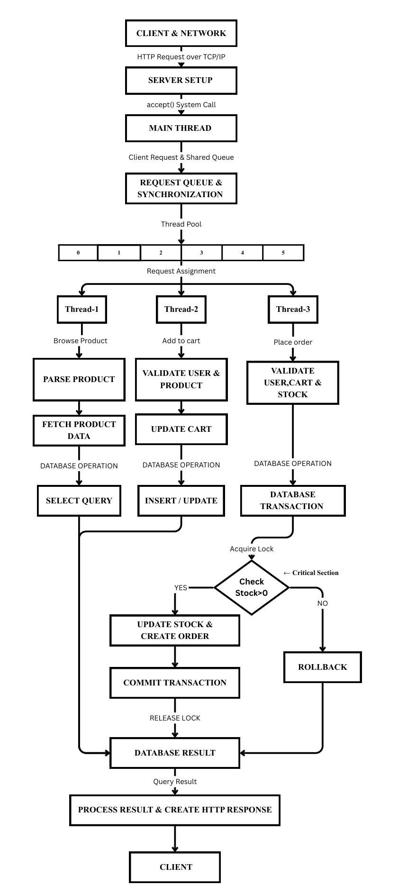

# Multithreaded Web Server with Database Integration

A multithreaded HTTP web server built in C++ that handles concurrent client requests using a custom thread pool and request queue, and performs transactional operations against a MySQL relational database for an e-commerce backend.

This project was built to explore how Operating Systems concepts (threads, synchronization, producer-consumer, critical sections) and DBMS concepts (transactions, ACID, concurrency control) come together in a real client-server system, rather than staying purely theoretical.

## Features

- Custom TCP socket server handling raw HTTP requests (GET/POST/PUT/DELETE)
- Thread pool with a shared request queue, synchronized via mutex + condition variable / semaphore
- Producer-consumer architecture: the main thread accepts connections and enqueues work; worker threads dequeue and process it
- Transactional order placement with stock validation as an atomic critical section (prevents overselling under concurrent load)
- Normalized MySQL schema: Users, Categories, Products, Cart, Cart_Items, Orders, Order_Items, Order_Status_History
- JSON-based request/response for a simple HTML/CSS/JS frontend

## Architecture

Client → TCP/HTTP → Main Thread (accept loop) → Request Queue → Thread Pool → Business Logic → MySQL (transactional) → HTTP Response

## Tech Stack

| Layer | Technology |
|---|---|
| Server / Backend | C++ (sockets, threads, mutex/condition_variable) |
| Database | MySQL |
| Frontend | HTML, CSS, JavaScript |
| Data format | JSON |
| Build | CMake |

## Database Schema

| Table | Primary Key | Foreign Key(s) |
|---|---|---|
| Users | user_id | — |
| Categories | category_id | — |
| Products | product_id | category_id |
| Cart | cart_id | user_id |
| Cart_Items | cart_item_id | cart_id |
| Orders | order_id | user_id |
| Order_Items | order_item_id | order_id |
| Order_Status_History | history_id | order_id |

## Concurrency Design 

- **Thread pool**: fixed-size pool of worker threads created at startup, avoiding the overhead of spawning a new thread per request.
- **Request queue**: a shared `std::queue` protected by `std::mutex`, with `std::condition_variable` used to wake idle workers (producer-consumer pattern).
- **Critical section**: stock check-and-update during order placement is wrapped in a single locked transaction to prevent race conditions between concurrent orders on the same product.
- **Rollback on failure**: if stock is insufficient or any step fails, the transaction is rolled back and the client receives a conflict response.

## Team

- Shoyam Bishnoi (Lead)
- Sneha Negi
- Ashutosh
- Aradhana K. Jaiswal
